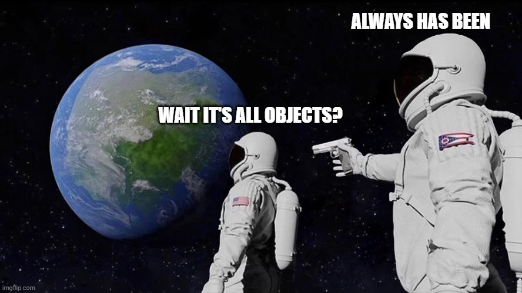

# Code Institute - Python Classes Live Coding Seminar

This GitHub Repo contains all of the files created during the Python Classes Live Coding Seminar.

## Overview

Throughout the seminar, a basic Flask application was created which performs all basic CRUD operations on a MongoDB database.

### app_basic.py

This python file is the initial Flask application, where the functionality is implemented using basic and procedural programming.

### app_function.py / example_functions.py

These python files demonstrate the refactored functionality, replacing the basic and procedural functionality with 
re-usable, clear, and seperated functions.

### app.py / example_classes.py

These python files demonstrate how recurring data structures and their associated methods can be grouped into classes,
to allow for the appropriate seperation of concerns, and improved readability of code.

### /static and /templates

These folders hold the neccessary HTML and CSS required for Flask and Python to generate web content. 

### How to Run

In order to test this code, please run `pip install -r requirements.txt`, then `python app.py`.

Whichever method of implementation you would like to test (basic, functions, or classes), replace the `app.py` file with the chosen file. For example, change `app.py` to `app_classes.py` and rename `app_function.py` to `app.py` if you would like to test the flask application using the functions implemented throughout the serminar.

### Further Reading

For interesting takes on Classes in Python, please see [Stop Writing Classes](https://www.youtube.com/watch?v=o9pEzgHorH0), [Start Writing More Classes](https://lucumr.pocoo.org/2013/2/13/moar-classes/), and [Stop Writing Stupid Classes](https://eev.ee/blog/2013/03/03/the-controller-pattern-is-awful-and-other-oo-heresy/).